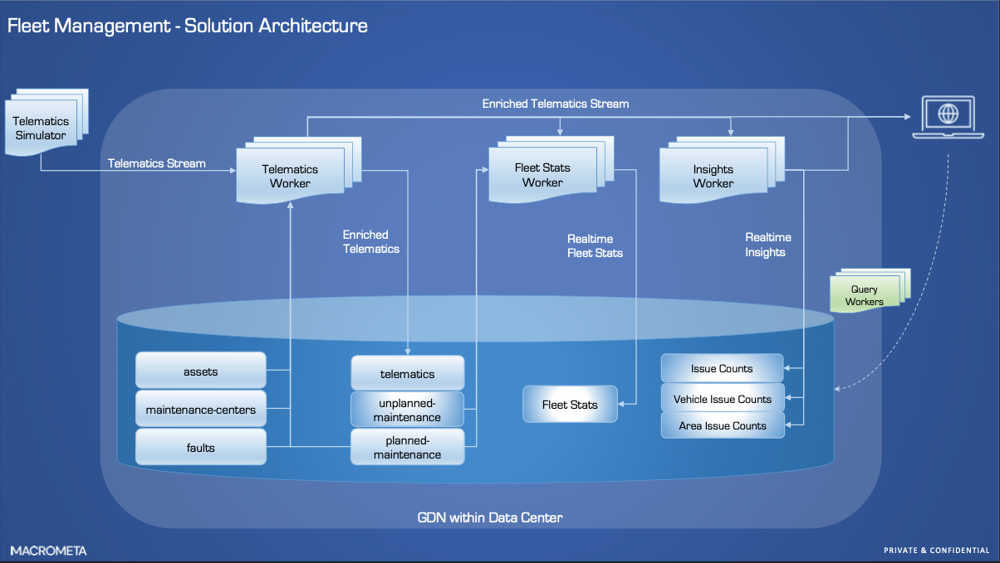
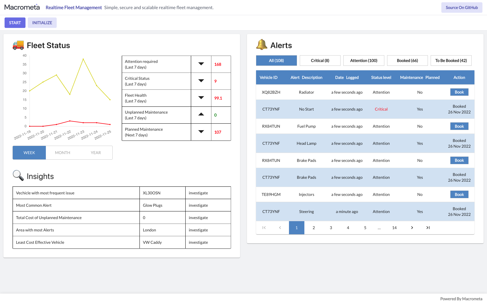

# Realtime fleet management using Macrometa GDN

### Live Demo: https://macrometacorp.github.io/demo-fleet-management/

Simple, secure and scalable realtime fleet management.

**Data Flows:**


**Dashboard:**


## Setup

| **Federation**                                        | **Email**                   | **Passsword** |
| ----------------------------------------------------- | --------------------------- | ------------- |
| [Global Data Network](https://gdn.paas.macrometa.io/) | --                          | `xxxxxxxx`    |
| [Demo Dashboard](https://macrometacorp.github.io/demo-fleet-management/)                                 | --                          | --            |

## How to Run

**On Federation:**

> ```
> Create and publish following Stream Workers in your federation:
> 1. insights-worker.md
> 2. fleet-stats-worker.md
> 3. telematics-worker.md
> 4. telematics-simulator.md
>
> Following Query Workers needs to be created:
> 1. load_maintenance_centers
> 2. load_vehicle_issue_counts
> 3. load_telematics
> 4. load_planned_maintenance
> 5. load_area_issue_counts
> 6. load_issue_counts
> 7. load_fleet_stats_counts
> 8. on_ready
> 9. is_demo_ready
> 10. get_asset_details
> 11. get_telematics_30_days
> 12. get_top5_maintenance_centers_for_city
> 13. is_asset_maintenance_planned
> 14. insert_unplanned_maintenance
> 15. get_telematic_simulator_input_alert
> 16. get_telematic_insights
> 17. get_fleet_stats
> 18. get_fleet_stats_chart_data
> 19. update_issue_counts
> 20. update_area_issue_counts
> 21. update_vehicle_issue_counts
> 22. update_fleet_stats
>
> Following doc collections needs to be created:
> 1. maintenance_centers_seed_data(seed data, global)
> 2. planned_maintenance_seed_data(seed data, global)
> 3. telematics_seed_data(seed data, global)
> 4. demo_status(global)
> 5. telematics(global)
> 6. assets(global)
> 7. faults(global)
> 8. maintenance_centers(global)
> 9. planned_maintenance(global)
> 10. unplanned_maintenance(global)
> 11. fleet_stats(global)
> 12. issue_counts(global)
> 13. area_issue_counts(global)
> 14. vehicle_issue_counts(global)
>
> Note: If you have run this tutorial before, you may want to truncate the collections.
> ```

**On Development Machine:**

> ```
> git clone https://github.com/Macrometacorp/demo-fleet-management.git
> cd demo-fleet-management
> git fetch
> npm install
> npm run start
> ```

## Details

### Stream Workers

- **[Telematics Simulator](stream-apps/telematics-simulator.md)**

- **[Telematics Worker](stream-apps/telematics-worker.md)**

- **[Fleet Stats Worker](stream-apps/fleet-stats-worker.md)**

- **[Insights Worker](stream-apps/insights-worker.md)**

### Document Collections

1. maintenance_centers_seed_data(seed data, global)
2. planned_maintenance_seed_data(seed data, global)
3. telematics_seed_data(seed data, global)
4. demo_status(global)
5. telematics(global)
6. assets(global)
7. faults(global)
8. maintenance_centers(global)
9. planned_maintenance(global)
10. unplanned_maintenance(global)
11. fleet_stats(global)
12. issue_counts(global)
13. area_issue_counts(global)
14. vehicle_issue_counts(global)

### Indexes

Create persistent indexes on the collection `planned_maintenance` and `telematics` for the attributes
| **Collection** | **Attribute** |
| ---------------- | ------------------------------- |
| planned_maintenance | `Asset` |
| telematics | `Asset` |
| telematics | `City` |
| telematics | `Fault` |
| telematics | `Timestamp` |


### Query Workers

- **[Query Workers](stream-apps/query-worker.md)**